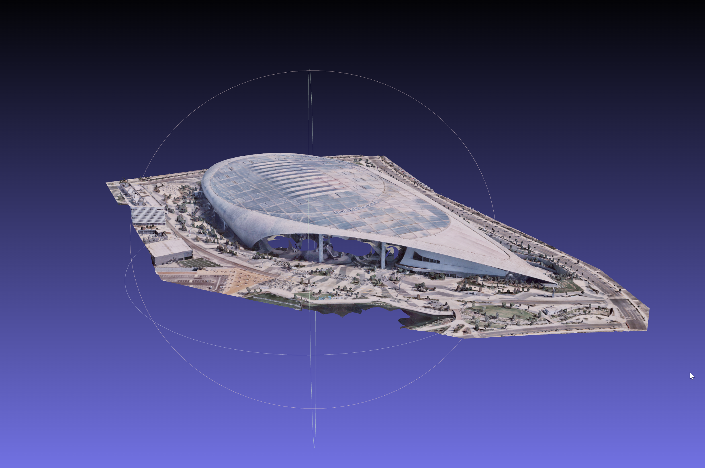
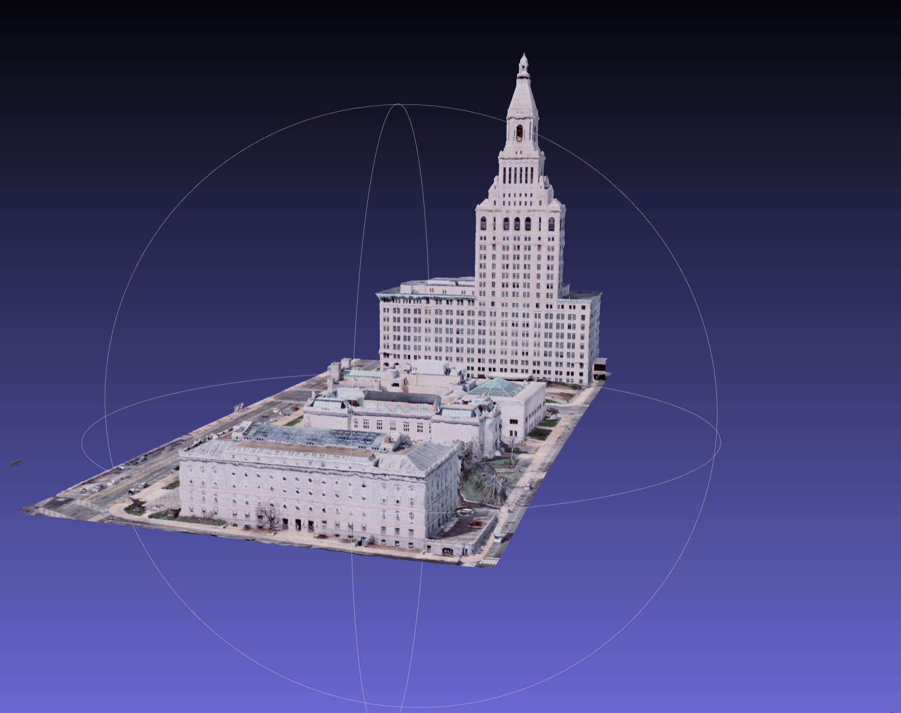

<div id="top"></div>

<!-- TABLE OF CONTENTS -->
<details>
  <summary>Table of Contents</summary>
  <ol>
    <li>
      <a href="#about-the-project">About The Project</a>
      <ul>
        <li><a href="#built-with">Built With</a></li>
      </ul>
    </li>
    <li>
      <a href="#getting-started">Getting Started</a>
      <ul>
        <li><a href="#prerequisites">Prerequisites</a></li>
      </ul>
    </li>
    <li><a href="#roadmap">Roadmap</a></li>
  </ol>
</details>

<!-- ABOUT THE PROJECT -->

## About The Project





Using Three.JS infrastrcuture to render Nearmap OBJ Objects.

Notes:

- Easy viewing in browser
- fast load times with custom lighting settings
- Codebase can be used to populate larger scale example Gallery Pages.
- Codebase Still being updated.

Please keep up to date with the repo, as this is still in development. Node JS Depolyment. Can run standard JS Live-Servers

<p align="right">(<a href="#top">back to top</a>)</p>

### Built With

This section lists any major frameworks/libraries used to bootstrap your project.

- [Node.js](https://nodejs.org/en/)
- [JQuery](https://jquery.com)
- [Three.js](https://threejs.org/)

<p align="right">(<a href="#top">back to top</a>)</p>

<!-- GETTING STARTED -->

## Getting Started

Clone Repo and run live server to run

### Prerequisites

- npm
  ```sh
  https://nodejs.org/en/
  ```
  ```sh
  https://threejs.org/
  ```

<!-- ROADMAP -->

## Roadmap

- [ ] multipage renderings
- [ ] Download OBJ sample button add.

<p align="right">(<a href="#top">back to top</a>)</p>
